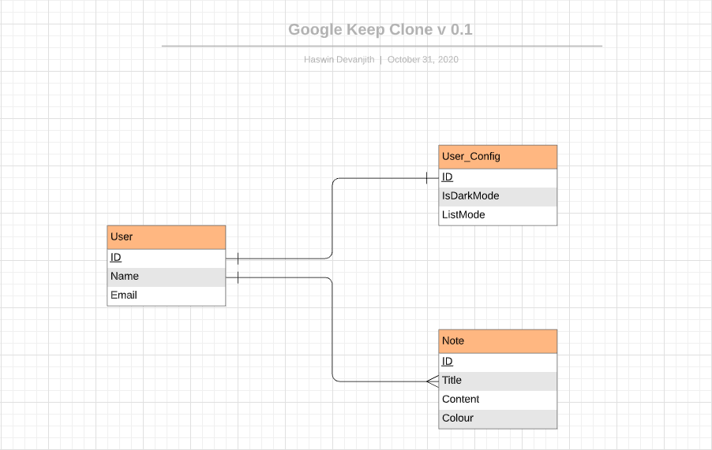

#  A Clone of Google Keep - Backend

This repository includes the backend for the [Google keep clone](https://github.com/HaswinVidanage/google-keep-clone-fe.git) project. Please refer the [readme](https://github.com/HaswinVidanage/keep-fe/blob/main/README.md). This is a personal project with the intention of introducing complex features like sharing, collaborating notes and reminders etc in the future and focusing mostly on the backend implementation.

[The backend API](https://github.com/HaswinVidanage/keep-clone-be) is written in [Golang](https://golang.org/) with [GqlGen](https://github.com/99designs/gqlgen).

<div align="center">
  [](https://keep-fe-clone.herokuapp.com/)
</div>

## Libraries Used
#### Backend 
* [Gqlgen](https://gqlgen.com/)
* [Wire](https://github.com/google/wire)
* [Migrate](https://github.com/golang-migrate/migrate)



#### Frontend 
* Refer to [Google keep clone frontend](https://github.com/HaswinVidanage/google-keep-clone-fe.git)

Here is a description from gqlgen about the generated files:
* gqlgen.yml — The gqlgen config file, knobs for controlling the generated code.
* graph/generated/generated.go — The GraphQL execution runtime, the bulk of the generated code.
* graph/model/models_gen.go — Generated models required to build the graph. Often you will override these with your own models. Still very useful for input types.
* graph/schema.graphqls — This is the file where you will add GraphQL schemas.
* graph/schema.resolvers.go — This is where your application code lives. generated.go will call into this to get the data the user has requested.
* server.go — This is a minimal entry point that sets up an http.Handler to the generated GraphQL server. start the server with go run server.go and open your browser and you should see the graphql playground, So setup is right!

### Generate gql
```bash
./do.sh gen-all
```bash

### Migration
```bash
migrate -database "mysql://<username>:<password>@tcp(localhost:3306)/keep_db" -path internal/pkg/db/migrations/mysql up
```

### Tests
```bash
go test ./...
```

```
MIT License

Copyright (c) 2020 Haswin Vidanage

Permission is hereby granted, free of charge, to any person obtaining a copy
of this software and associated documentation files (the "Software"), to deal
in the Software without restriction, including without limitation the rights
to use, copy, modify, merge, publish, distribute, sublicense, and/or sell
copies of the Software, and to permit persons to whom the Software is
furnished to do so, subject to the following conditions:

The above copyright notice and this permission notice shall be included in all
copies or substantial portions of the Software.

THE SOFTWARE IS PROVIDED "AS IS", WITHOUT WARRANTY OF ANY KIND, EXPRESS OR
IMPLIED, INCLUDING BUT NOT LIMITED TO THE WARRANTIES OF MERCHANTABILITY,
FITNESS FOR A PARTICULAR PURPOSE AND NONINFRINGEMENT. IN NO EVENT SHALL THE
AUTHORS OR COPYRIGHT HOLDERS BE LIABLE FOR ANY CLAIM, DAMAGES OR OTHER
LIABILITY, WHETHER IN AN ACTION OF CONTRACT, TORT OR OTHERWISE, ARISING FROM,
OUT OF OR IN CONNECTION WITH THE SOFTWARE OR THE USE OR OTHER DEALINGS IN THE
SOFTWARE.

```